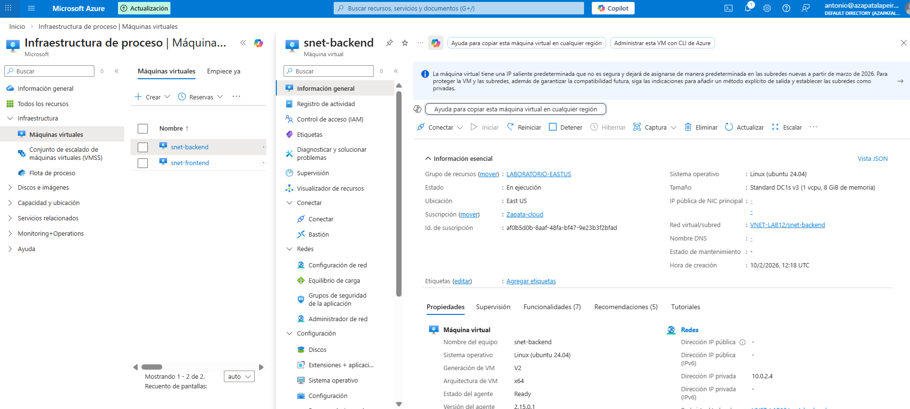
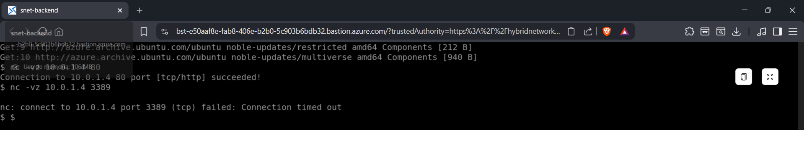

# Lab 14 - Administración segura de máquinas virtuales con Azure Bastion

## Objetivo
Administrar máquinas virtuales de forma segura sin exponer puertos de gestión (SSH/RDP) a Internet, reduciendo la superficie de ataque y evitando accesos por fuerza bruta.

## Qué he hecho en este laboratorio
1. He utilizado un Azure Bastion ya desplegado en la VNet para la administración segura.
2. He eliminado la IP pública de una máquina virtual Linux del BackEnd.
3. He accedido a la máquina virtual exclusivamente a través de Azure Bastion desde el portal.
4. He comprobado que la administración es posible sin abrir los puertos 22 o 3389.

## Configuración utilizada
- VNet: `VNET-LAB12`
- Subred dedicada: `AzureBastionSubnet`
- Servicio: Azure Bastion
- Máquina virtual:
  - Nombre: `snet-backend`
  - Sistema operativo: Linux (Ubuntu)
  - Sin IP pública
  - Acceso únicamente mediante Bastion

## Evidencias

### 01 - Máquina virtual sin IP pública

### 02 - Sesión activa mediante Azure Bastion

## Checklist de verificación
- [x] La máquina virtual no tiene IP pública
- [x] No hay puertos SSH/RDP expuestos a Internet
- [x] Acceso realizado únicamente mediante Azure Bastion

## Qué le diría a un cliente o en entrevista
“Con Azure Bastion evito exponer puertos de administración a Internet. Las máquinas no necesitan IP pública y el acceso se realiza de forma segura desde el portal, reduciendo claramente la superficie de ataque.”
